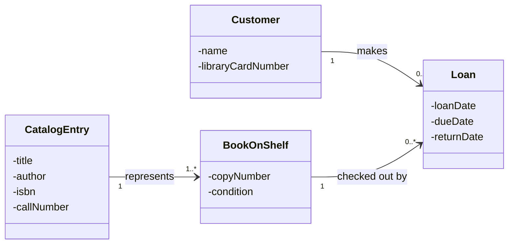

# Classes

- For naming a class use CamelCase some examples include:
	- CustomerOrder
	- ArtWork
	- SchoolFaculty
	- PhoneSpecifications
- Class names should be a single noun such as Customer, Order, or Vendor
- The first character of a class name must be capitalized
- Definition informs the reader on the meaning rather than what it does
- Generally you start a definition more general and gradually ger more specific the longer it gets
	- i.e. "Department" might be defined as "An organization that offers one or more degree programs within a college, within a university.  For instance, the Computer Engineering Computer Science (CECS) department is part of the College of Engineering within California State University Long Beach."
	- this starts general: organization, and gets more specific: department
	- Not all organizations are departments, but all departments are organizations
- Don't use any pat of the class name in the definition since this could make the definition circular, meaning you need to know what the class name is signifying to understand the definition
	- For instance, the definition of the class ArtWork could be "A work of art put on public display to provide inspiration to all viewers."  The use of "art" and "work" in the definition makes that definition circular.  You have to know what "art" is in order to know what "ArtWork" is.  A better definition for ArtWork would be "A visual display that the creator has constructed to convey an emotion, meaning, or concept to their audience."
- You can give examples instead to give an idea to the reader, in reference to the ArtWork class you could say: "Examples would include: paintings, sculpture, or light shows.". Be sure the examples aren't all inclusive however as there may be other instances of the class that don't fall into the the example categories
- Be sure to define what the class **is**, not what you can do with instances of that class.
- Don't include the uniqueness either as that would be captured in the Entity Relationship Diagram (ERD) if it is implemented in a relational database, or in the Moon Modeler model if it is implemented as a collection

# Attributes

- Attribute names differ slightly, the first letter must be a lowercase such as:
	- dateOFBirth
	- year
	- studentNumber
	- carModel
- When chosing an attribute name it is also important to separate the class name from the attribute name, for example: many of your classes will have a column called “name”.  The name of the attribute must be unique within the class, and nothing more.
- Attributes must be atomic, meaning they can only have one concept
- CECS 323 is not atomic as it contains the abbreviated department name and the course number itself
- Attribute values describe objects within a class, for example the chair attribute of the Department class signifies the faculty member currently serving as the department chair
- if the attribute is a unit of measurement be sure to specify the units
- any constraints the attribute may have also needs to be clearly stated with the best location being the attribute definition
- valid examples of valid attribute values would also help the reader understand the meaning
- similar to classes, attribute names cannot appear in the definition of the attribute as it would be circular
- for the attribute "name" in the Customer class the definition would need to be similar to: "A succession of printable characters that identifies the specific customer."
- don't put the specific data type of the attribute in the definition either as that will be handled in the graphical model
- the graphical model captures the data type while the definition describes the attribute tied to that data type
- placing it in the definition is redundant and also can lead to a data type mismatch if the definition calls for a different datatype than the graphical model

# Associations

## One to Many

- When naming a one to many relationship  it is important that the verb should read like a sentence in that context of the parent and child class
- for example: "Each Customer places zero or more Orders.” the parent is Customer the child is Order and the verb phrase is "places" meaning when you read it you see a singular object (the customer) doing a possible multitude of actions (places) so in this case the customer (one) places (many) zero to one orders. it is also important to make the verb phrase active

## Many to Many

- given how dynamic many to many naming conventions can be thee is no real correct solution, rather, pick a verb phrase that reads well from left to right

# Entity Relationship Diagrams/Physical Database

- Table naming conventions apply to MongoDB collections as well.
- Column naming conventions apply to MongoDB fields as well.
## Chartmanship

- Be sure to put the entities (table names) above, or if not, to the left of the child so as to make it easier to read
- avoid crossing relationship lines where possible as well
## Table and Column Names

- use "snake case"
	- pun and underscore `(_)` between each word
	- convert UML names to all lowercase
- Be sure to keep the names as close to its UML as possible
## Table Names

- Use plural nouns for table names while being in line with the UML class names
- for example if a UML class name is Department the table name in the ERD would be departments
	- the main reason for plural naming is that the table is a set of rows
	- in contrast, a class represents a prototype for objects which are members of said class
## Constraint Names

1. Primary key constraints are named similarly to the table with "`_pk`" on the end
2. Uniqueness constraints (also called candidate keys) are named similarly to the table with "`_uk_XX`" on the end where XX is a two digit number that helps distinguish one candidate key from another within a given table
3. Foreign key constraints are named as follows
	- the name of the child table followed by "`_`"
	- Followed by the name of the parent table, followed by "`_fk_XX`"
	- Where the XX represents a two digit number to allow us to distinguish between several relationships connecting connecting the same parent to the same child
4. Check constraints are named after the table followed by "`_`" followed by a short phrase describing the constraints
	- for example a check constraint that ensures a students grade in a course never exceeds 4 may be named `enrollment_grade_maximum` if the table that stores the grade is called "enrollment"

# Private Visibility in UML Class Models

## Introduction

- You can set attributes of a UML class to private by denoting a `-` before the denoted attribute name. Examples include:
	- - pizzaName
	- - slicePrice
	- - carModel
	- - studentNumber
- Doing this allows for these attributes to only be accessed by methods within the class itself
- Generally it is best practice to protect the state of a class by making all the associated attributes private values of that class
- With this the only reliable way to change the value of a private attribute is with getters and setters
- Where getters return the value of a given attribute and setters initialize the requested change
## Rationale for Getters and Setters

Object Oriented (OO) languages such as Java and C++ regularly enforce getters and setters due to direct field access creating tight coupling throughout the program where for example if an attribute changes from a stored field to a dynamic calculation, direct field access breaks every client relying on variable access syntax (simply meaning calling the variable from the class), requiring them to update their code to call a function instead. Getters and Setters allow for an abstraction layer between the class variables and the updated values it receives over time. 
- Validation: Setters act as gatekeepers to enforce domain rules and boundary conditions-such as rejecting negative values for age, out-of-range dates, or invalid formatted strings-preventing the object from entering an illegal state
- Computed Properties: Getters and Setters also allow for altering computed values without needing to change the public methods themselves, such as re calculating density behind the scenes
## Alas Python

(Instructors Thoughts on Python)
That having been said, all of the above gets a little fuzzy with Python since Python has no strong encapsulation of any of its attributes or methods.  I'm sure that a "Pythonista" programmer would be able to expound at length on why that's such a great idea, but I just think it's a bit lame.

Be that as it may, we are going to always use the private visibility in our UML models in acceptance of generally accepted good design practice, even though the OO platform that we happen to be using doesn't explicitly support visibility of the attributes and methods.  Sort of lame, I know, but nothing in life is perfect, even in computer science.

# UML Modeling ID Associations

## Basic Structures: Object Relationships

UML model associations generally follow 4 main groupings:
- One to One (1 : 1)
- One to Many (1 : N)
- Many to One (N : 1)
- Many to Many (N : N)

With each endpoint of a class having a min and a max which help us determine which of these four groupings the relationship falls into

| **Left Endpoint Multiplicity** | **Right Endpoint Multiplicity** | **Maximums (Left : Right)** | **Relationship Name** | **Example**                                              |
| ------------------------------ | ------------------------------- | --------------------------- | --------------------- | -------------------------------------------------------- |
| `0..1` or `1..1`               | `0..1` or `1..1`                | **1 : 1**                   | **One-to-One**        | Person $\leftrightarrow$ Passport                        |
| `0..1` or `1..1`               | `0..*` or `1..*`                | **1 : N**                   | **One-to-Many**       | Customer $\leftrightarrow$ Payment                       |
| `0..*` or `1..*`               | `0..1` or `1..1`                | **N : 1**                   | **Many-to-One**       | Payment $\leftrightarrow$ Customer (perspective flipped) |
| `0..*` or `1..*`               | `0..*` or `1..*`                | **N : M**                   | **Many-to-Many**      | Student $\leftrightarrow$ Course                         |

 Moving back a little lets look at each endpoint individually. The minimum and maximum of each endpoints is called the **multiplicity** which is formatted as `[Min]..[Max]`. The multiplicity itself has two parts, **the participation** and **the cardinality**.
 - participation is either mandatory (`1`) or optional (`0`) this is seen as the `[Min]`
 - where the cardinality determines the maximum number of instances that can be related to, this can also be called the constraints this is seen as the `[Max]`

Looking at the Customer $\leftrightarrow$ Payment relationship above, we can see it is a One to Many (1:N) pairing. this can me shown by denoting each endpoint of a class with its respective multiplicity value.
- Customer -> `1..1`: Each payment must be related to one customer, (the 1 at the beginning) and no more than one customer (the 1 at the end)
- Payment -> `0..*`: A customer may not be related to any payments (the 0 at the beginning) or many payments (the * at the end)
- Therefore with this example a multiplicity of 0..0 or 1..0 makes zero sense
When writing out this relation in plain English it would read as follows: "Each customer remits _zero or more_ payments.” (The symbol *  means “many”, and any quantity more than one is considered to be “many” in a database.) Writing it out in simple terms would go as follows: “Each payment is remitted by _one and only one_ customer.”

When writing out the relations in English we can use certain vocabulary terms to help denote the specific multiplicity values at each endpoint. For example we use **must** to signify mandatory participation (1 or more), **may** to signify optional participation (0 or more), and **each** to signify a singular instance of a class (each customer)

In the example above we call this a binary association as it links only two classes together. However, it is possible to link more than two classes together in which case we call it a n-ary association. With binary associations we label one class as the **parent** and one as the **child** with our One to Many(1:N) association the parent is the "one" side of the model (customer) and the **child** is the "many" (payments) side of the model.
## Lookup Tables

**Introduction:** When creating classes we can sometimes run into issues where the values of certain attributes could be out of bounds. For example if a college course is only offered in the fall semester but the string value for semester is spring. we now have an invalid attribute value leading to an error as the database will look at the spring semester and not find the class. This can be solved by creating separate association classes. As a quick note it is important to remember that with each side class created, the main class will need an exact 1..1 multiplicity to ensure referential .

![[UML Lookup Tables.png]]

Looking at thee UML diagram above, The main `Section` class has many look up classes that allow us to verify certain attributes and quantities through  multiplicities.  Going through the table we have:
- `Semester` $\rightarrow$ `Sectionn` (`1..1 to 0..*`)
	- This link means that each section can only be assigned to exactly one semester. Additionally, one semester can have 0 or many sections tied to the same one
- `Building` $\rightarrow$ `Section` (`1..1 to 0..*`)
	- This link tells the sections where it will be located when the class starts
- `Building` $\rightarrow$ `Department` (`1..1 to 0..*`)
	- Building here is reused to also locate department offices
- `Instrucotr` $\rightarrow$ `Section` (`1..1 to 0..*`)
	- This link shows how each section has exactly one assigned Instructor

With this information we can also better understand why look up tables are better than enumeration data types because:

| **Aspect**             | **Enumerations (Enums)**                                       | **Lookup Tables / Classes**                                                          |
| ---------------------- | -------------------------------------------------------------- | ------------------------------------------------------------------------------------ |
| **Adding New Values**  | Requires updating code/schema and redeploying software.        | Simply insert a new row/document into the lookup table (no code changes).            |
| **Enterprise Sharing** | Difficult to keep synchronized across different apps/services. | Easily shared centrally across the entire database/enterprise.                       |
| **Data Quality**       | Restricted to hardcoded developer options.                     | High quality; multiple application stakeholders interact with and validate the data. |
| **System Integration** | Harder to map across external software.                        | Fosters consistency and simplifies cross-application integration.                    |

# Refactor the Relation

## Redundancy & Integrity

Databases need to able to store all of the necessary data a company may need/produce over its running lifespan. This can have some varying complications if the data is not handled correctly. As an example if the database needs to store information regarding the weight of a package but the current database has no column or row to store that specific piece of information, the entire database would need to be restructured to accommodate the new attribute value. Similarly if a database stores unnecessary information this could cause risk/liability, and wastes storage if the data is not handled properly. The best practice to avoid this is to store all data as basic text strings in generic column names such as cloA, cloB, cloC. It is also worth noting to set them to maximum widths to avoid any potential overflows.

Accurate data is widely considered accurate data, Another interpretation is to see this as data that is not impossible/corrupted. Although this is the ideal scenario data can be very reasonable and unreasonable. For example, if someone get your date of birth wrong they still chose a real date on a calendar. 

Data inaccuracy can occur for many potential reasons:

- The user misinterpreted the data.
    - This is particularly likely if the database structure is not descriptive. Naming a column something like "cola" provides nothing in the way of the intended meaning of the data stored in that column.
    - If the data value is a quantity, and the units are not specified, or the user fails to take the units into account. For instance, if a column is recorded in kg but the user thought it represented pounds.
- The data was wrong in the first place.
    - For instance a person's birth date was entered with the wrong year.
    - The data value could **never** have been right.
        - The datatype of the entered value was wrong. For instance, putting a person's name in the column designated for their birth date.
        - The value was impossible.
            - For instance, a semester name of 'Summer IV' when there are never more than three sessions in the summer.
            - For instance, putting in the name of a non-existent instructor for a section.
- The data was right to begin with, but became out of date. For instance, if your database manages inventory records and that includes the quantity on hand for each product, when a sale occurs, the quantity on hand must be decremented to reflect the sales transaction, or the data becomes wrong because it is no longer accurate.
- The data is contradictory. The same piece of information can be stored more than once in the database. If that is the case, those multiple copies of the same information **could** disagree with each other.

Some good strategies to enforce integrity throughout the database include:
- **Descriptive Naming & Data Dictionary:** Use clear structural names and maintain a narrative **data dictionary** (glossary) so users understand what data is being recorded.
    
- **Strict Datatypes:** Avoid defaulting to text strings. Use specific datatypes (such as native `Date` formats) to allow the database system to automatically reject invalid inputs (e.g., Feb 30th) and provide useful built-in operators.
    
- **Domain Constraints & Lookup Tables:** Restrict allowed values using rules (e.g., age constraints) or **Lookup Tables** (e.g., a master list of valid semesters) to prevent impossible data entries.

One final thing to keep note of when building and storing databases is to be aware of redundancy in terms of repeated attributes. These are spread across three main data anomalies:
- **Insertion Anomalies:** Inconsistent or contradictory data can easily be introduced when inserting a new record (e.g., adding a course with a misspelled department chair name).
    
- **Update Anomalies:** Changing a single shared fact (e.g., updating a department chair) requires modifying every duplicate row. Missing a single row results in conflicting data.
    
- **Deletion Anomalies:** Deleting an entity (e.g., removing a department's last remaining course offering) inadvertently wipes out all stored knowledge about the parent entity (e.g., losing the entire department's office location and chair information).

The solution is to refractor the database schemas. This ensures each fact is captured in a single place. instead of per each instance.

## Functional Dependencies

Functional Dependencies describes relationships between attributes within a database relation
- **Notation:** $X \rightarrow Y$ (Read as: _"X functionally determines Y"_ or _"Y is functionally dependent on X"_).
    
- **Core Principle:** If two rows agree on the value(s) of attribute set $X$, they **must** agree on the value(s) of attribute set $Y$.
    
- **Determinant:** $X$ is called the **determinant** (the left-hand operand).
    
- **Business Rule Connection:** FDs formally express business rules that rule out impossible data states.
	- in other words, functional dependencies show connections between attributes to prevent impossible data from being validated

Some examples include:
- `{department} → {chair}` $\rightarrow$ Knowing the department tells you the department's chair.
    
- `{department, course_number} → {name}` $\rightarrow$ Knowing both department and course number uniquely identifies the course name.

These are based on Armstrong's Axioms which comprise of three different rules
**reflexivity**
- If X is a set of attributes and Y is a subset of X, then X functionally determines Y. More formally, if Y⊆X then X→Y.
**augmentation**
- If X, Y, and Z are sets of attributes in the same relation scheme, and X functionally determines Y, then XZ functionally determines YZ. More formally, if X→Y then XZ→YZ.
**transitivity**
- If X functionally determines Y and Y functionally determines Z, then X functionally determines Z. More formally, if X→Y and Y→Z then X→Z.

From these there are also secondary rules that can be proven which can save time when proving new functional dependencies.
Union: If X→Y and X→Z then
1. X→Y (Given)
2. X→Z (Given)
3. X→XZ (By applying the Augmentation axiom to #2 and X)
4. XZ→YZ (By applying the Augmentation axiom to #1 and Z)
5. X→YZ (By applying Transitivity to 3 and 4)

Decomposition: if X→YZ then X→Y **and** X→Z.
1. X→YZ (Given)
2. YZ→Y (Reflexivity)
3. X→Y (transitivity of 1 & 2)

Given Armstrong's axioms, the secondary rules, and the functional dependencies cited above, we can prove that {department, course_number}→{chair, building, room, name, units} and {department, name}→{chair, building, room, course_number, units} as follows:
1. {department}→{chair} (given)
2. {department}→{building} (given)
3. {department}→{room} (given)
4. {department}→{chair, building, room} (By the Union secondary rule)
5. {department, course_number}→{name} (given)
6. {department, course_number}→{units} (given)
7. {department, course_number}→(name, units) (By the Union secondary rule)
8. {department, course_number}→{chair, building, room, name, units} (By applying composition to 4 and 7, i.e. if $A \rightarrow B$ and $C \rightarrow D$, then $AC \rightarrow BD$)
9. {department, name}→{course_number, units} (Just as we did #7 above)
10. {department, name}→{chair, building, room, course_number, units} (Just as we did 8 above)

However before proving super keys we first need to look at everything a set can determine using attribute closures:

- **Definition:** $X^+$ is the set of all attributes that are functionally determined by $X$ under a set of FDs.
- **How it works:**
    1. Start with $X^+ = X$.
    2. Search your list of FDs for any dependency $A \rightarrow B$ where $A \subseteq X^+$.
    3. Add $B$ to $X^+$.
    4. Repeat until $X^+$ stops growing.
- **Key Rule:** If $X^+ = R$ (all attributes in the schema), then **$X$ is a Superkey**.

**Trivial vs Non-Trivial functional dependencies:**
- **Trivial FD:** An FD $X \rightarrow Y$ is trivial if $Y \subseteq X$ (e.g., $\{\text{department, course\_number}\} \rightarrow \{\text{department}\}$). These add no new information and are always true by Reflexivity.
    
- **Non-Trivial FD:** An FD where $Y$ is not a subset of $X$ (e.g., $\{\text{department}\} \rightarrow \{\text{chair}\}$). Database design focuses entirely on non-trivial FDs.

A **Superkey** is any set of one or more attributes that functionally determines **all attributes in the relation scheme $R$**.

If $R = \{\text{department, chair, building, room, course\_number, name, units}\}$, then any set $X$ where $X \rightarrow R$ is a superkey:
- **Proof #8:** $\{\text{department, course\_number}\} \rightarrow \{\text{chair, building, room, name, units}\}$
- **Proof #10:** $\{\text{department, name}\} \rightarrow \{\text{chair, building, room, course\_number, units}\}$

Because both $\{\text{department, course\_number}\}$ and $\{\text{department, name}\}$ functionally determine **every other attribute in the table**, both of these sets are **Superkeys**.

Imagine you query a relation table that enforces these superkey rules.
#### Scenario A: Using $\{\text{department, course\_number}\}$ as a Superkey

- You tell the database: _"Look up the row where `department = 'CECS'` and `course_number = 323`."_
- Because $\{\text{department}\} \rightarrow \{\text{chair, building, room}\}$, knowing `CECS` immediately locks in `chair = 'Aliasgari'`, `building = 'ECS'`, and `room = 540`.
    
- Because $\{\text{department, course\_number}\} \rightarrow \{\text{name, units}\}$, knowing `CECS 323` immediately locks in `name = 'Database Fundamentals'` and `units = 3`.
    
- **Result:** There can **never** be two different rows for `CECS 323` that have different chairs, rooms, or course names. The database guarantees that this combination points to **exactly one unique set of values**.
    

#### Scenario B: Using $\{\text{department, name}\}$ as a Superkey

- You tell the database: "Look up the row where `department = CECS and name = Database Fundamentals."

- Following the exact same logic, knowing the department name and course title allows the database to derive `course_number = 323`, `units = 3`, `chair = 'Aliasgari'`, etc.

- **Result:** $\{\text{department, name}\}$ is also a valid unique identifier for any row in the table.

With all this layout here is the ordering in hierarchy of primary keys, super keys, and candidate keys
- **Superkey:** Any combination of attributes that determines all remaining attributes.
    - Example: $\{\text{department, course\_number, building}\}$ is a superkey because it determines everything in the row. However, `building` isn't actually needed!
        
- **Candidate Key:** A **minimal** superkey. If you remove even one attribute from it, it loses the ability to determine all remaining attributes.
- $K$ is a Candidate Key for schema $R$ if and only if:
	1. $K \rightarrow R$ ($K$ is a superkey), AND
	2. For any attribute $A \in K$, $(K - \{A\}) \not\rightarrow R$ (no proper subset of $K$ is a superkey).
- $\{\text{department, course\_number}\}$ is a Candidate Key (if you remove `course_number`, `{department}` alone cannot determine the course `name`).
- $\{\text{department, name}\}$ is also a Candidate Key.

- **Primary Key:** The single Candidate Key chosen by the database designer to act as the official identifier for rows in the table (typically $\{\text{department, course\_number}\}$).

The reason we look for superkeys in the at all is to remove redundancy. Look back through our examples, the attribute `department` shows up in multiple contexts, we proved this by creating functional dependencies which reveals a partial dependency (where a non-key attribute depends on only _part_ of the candidate key $\{\text{department, course\_number}\}$) With this partial dependency it proves redundancy causing us to split the scheme into two separate relations (tables)
## Subkey Resolution

Here is a table that describes the variables in relation to the school course table

| **Variable** | **Definition**                                                           | **Significance / Role**                                                                                                                                             |
| ------------ | ------------------------------------------------------------------------ | ------------------------------------------------------------------------------------------------------------------------------------------------------------------- |
| **$R$**      | The original relation schema.                                            | The initial table structure being evaluated for redundancy (e.g., $R = \{\text{department, chair, building, room, course\_number, name, units}\}$).                 |
| **$W$**      | The determinant set of attributes causing the subkey/partial dependency. | A minimal proper subset of $R$ that functionally determines other attributes, but **does not** determine all attributes in $R$ (e.g., $W = \{\text{department}\}$). |
| **$Z$**      | The set of attributes dependent solely on $W$.                           | The attributes that are functionally determined by $W$, but are redundant when stored alongside $R$ (e.g., $Z = \{\text{chair, building, room}\}$).                 |
| **$R_1$**    | The newly created parent/lookup relation scheme.                         | $R_1 = W \cup Z$. It isolates $W$ and $Z$ into a standalone table so that $W \rightarrow Z$ is stored **exactly once** (e.g., the `DEPARTMENTS` table).             |
| **$R_2$**    | The newly created child/referencing relation scheme.                     | $R_2 = R - Z$. It keeps $W$ as a foreign key to link back to $R_1$, while stripping out $Z$ to eliminate duplicate data (e.g., the new `COURSES` table).            |

To spot redundanncy within a given data set we can follow two main steps:

| **Step**               | **Action**                                                     | **Purpose**                                                         |
| ---------------------- | -------------------------------------------------------------- | ------------------------------------------------------------------- |
| **1. Identify FDs**    | Formulate dependencies like $W \rightarrow Z$                  | Expose subkeys and prove where redundancy occurs.                   |
| **2. Refactor Schema** | Split $R$ into two tables ($R_1 = W \cup Z$ and $R_2 = R - Z$) | Eliminate duplicate data, update anomalies, and deletion anomalies. |

When discovering redundancy we refractor the current functional dependencies into their own tables in order to get rid of sub keys. By doing this a few issue are resolved with our current school course dataset, those include:
- **Insertion Anomalies Resolved:** New courses can be added without repeating or risking contradictory department data.    
- **Update Anomalies Resolved:** If a department chair changes, the modification is made in a single tuple in the new department relation.
- **Deletion Anomalies Resolved:** Deleting all courses from a department no longer erodes the existence of the department itself.

With our table now split into $R_1$ and $R_2$  we need to ensure nothing was lost during the split. We can also call it lossless,  to determine this we need to look at a couple things:
- **Definition:** A decomposition is **lossless** if joining $R_1$ and $R_2$ back together via a relational `JOIN` (e.g., `INNER JOIN ... USING(department)`) reproduces the exact original set of tuples in $R$.
- **Criteria:** No original rows are lost, and no spurious/false rows are generated during the join operation.

Now lets take a look at the general break down for creating lookup tables based on keys found in functional dependencies

The algorithm takes a bloated relation scheme $R$ and splits it into two smaller schemes $R_1$ and $R_2$ using a problematic functional dependency $W \rightarrow Z$:

- **Original Relation Scheme ($R$):**    $$R = \{\text{department, chair, building, room, course\_number, name, units}\}$$
- **The Problematic FD ($W \rightarrow Z$):**$$\{\text{department}\} \rightarrow \{\text{chair, building, room}\}$$
    - $W = \{\text{department}\}$ (the minimal determinant causing redundancy).
	    - This can also be known as the minimal sub key
    - $Z = \{\text{chair, building, room}\}$ (the non-key attributes being repeated).
	    - This can also be known as the dependencies of the minimal sub key

To isolate the redundancy, we construct two separate relations:
1. **Creating $R_1 = W \cup Z$ (The Lookup / Parent Table):**
    
    - Combine $W$ and $Z$:$$R_1 = \{\text{department}\} \cup \{\text{chair, building, room}\} = \{\text{department, chair, building, room}\}$$
    - **Why?** This table isolates department-specific information so that each department's chair, building, and room are defined **exactly once**.
        
2. **Creating $R_2 = R - Z$ (The Child Table):**
    
    - Remove $Z$ from the original attributes $R$:
    - $R_2$ = {department, chair, building, room, course_number, name, units}\} - {chair, building, room}
    - $R_2$ = {department, course_number, name, units}

    - **Why?** We subtract $Z$ to stop repeating chair, building, and room inside every course record. Notice $W$ ($\{\text{department}\}$) remains in $R_2$ so it can act as a **Foreign Key** to link back to $R_1$.

The algorithm loops recursively: after creating $R_1$ and $R_2$, you must test both new tables to ensure neither contains any hidden subkey redundancies.

#### Evaluating $R_1$ (`departments`):

- **Functional Dependency in $R_1$:** $\{\text{department}\} \rightarrow \{\text{chair, building, room}\}$
    
- **Total Attributes in $R_1$:** $\{\text{department, chair, building, room}\}$
    
- **Analysis:** The determinant $\{\text{department}\}$ functionally determines **all** remaining attributes in $R_1$. Therefore, $\{\text{department}\}$ is a candidate key for $R_1$.
    
- **Conclusion:** Because the determinant is a candidate key for the entire relation $R_1$, **no redundancy exists in $R_1$**.
    

#### Evaluating $R_2$ (`courses`):

- **Functional Dependencies in $R_2$:**
    1. $\{\text{department, course\_number}\} \rightarrow \{\text{name, units}\}$
    2. $\{\text{department, name}\} \rightarrow \{\text{course\_number, units}\}$
        
- **Total Attributes in $R_2$:** $\{\text{department, course\_number, name, units}\}$
    
- **Analysis:**
    
    - In FD #1, $\{\text{department, course\_number}\}$ determines all remaining attributes in $R_2$ ($\text{name}$ and $\text{units}$). Thus, $\{\text{department, course\_number}\}$ is a candidate key for $R_2$.
        
    - In FD #2, $\{\text{department, name}\}$ determines all remaining attributes in $R_2$ ($\text{course\_number}$ and $\text{units}$). Thus, $\{\text{department, name}\}$ is also a candidate key for $R_2$.
        
- **Conclusion:** Since both determinants determine the entirety of $R_2$ (there are no attributes left over that depend on only a partial key or non-key attribute), **no redundancy exists in $R_2$**.
## Relation Substitution Inference Rule

The **Substitution Inference Rule** is a secondary rule (or shortcut) derived from Armstrong's Axioms.

- **Proposition:** If $A \rightarrow B$ and $B \rightarrow A$ (meaning $A$ and $B$ are equivalent determinants), then:
    - $B$ can replace $A$ in any functional dependency to produce an equally valid functional dependency.
    - $A$ can replace $B$ in any functional dependency to produce an equally valid functional dependency.
#### Case 1: Simple Substitution ($A \rightarrow C \implies B \rightarrow C$)

1. $B \rightarrow A$ (Given)
2. $A \rightarrow C$ (Given)
3. $B \rightarrow C$ (By Transitivity on 1 and 2)
    

#### Case 2: Determinant Set Substitution ($\{A, C\} \rightarrow \{D\} \implies \{B, C\} \rightarrow \{D\}$)

1. $\{B, C\} \rightarrow \{B\}$ (By Decomposition)
2. $\{B\} \rightarrow \{A\}$ (Given)
3. $\{B, C\} \rightarrow \{A, B, C\}$ (By Augmentation / Transitivity)
4. $\{B, C\} \rightarrow \{A, C\}$ (By Decomposition)
5. $\{A, C\} \rightarrow \{D\}$ (Given)
6. $\{B, C\} \rightarrow \{D\}$ (By Transitivity on 4 and 5)
    

#### Case 3: Dependent Set Substitution ($\{C\} \rightarrow \{A, D\} \implies \{C\} \rightarrow \{B, D\}$)

1. $\{C\} \rightarrow \{A, D\}$ (Given)
2. $\{C\} \rightarrow \{A\}$ (By Decomposition)
3. $\{A\} \rightarrow \{B\}$ (Given)
4. $\{C\} \rightarrow \{A, B, D\}$ (By Augmentation / Transitivity)
5. $\{C\} \rightarrow \{B, D\}$ (By Decomposition)
    
When attributes are interchangeable (e.g., $\text{department\_abbreviation} \leftrightarrow \text{department\_name}$), they generate duplicate pairs of functional dependencies:

6. $\{\text{dept\_abbr}, \text{course\_num}\} \rightarrow \{\text{dept\_abbr}, \text{course\_name}\}$
7. $\{\text{dept\_abbr}, \text{course\_name}\} \rightarrow \{\text{dept\_abbr}, \text{course\_num}\}$
8. $\{\text{dept\_name}, \text{course\_num}\} \rightarrow \{\text{dept\_name}, \text{course\_name}\}$
9. $\{\text{dept\_name}, \text{course\_name}\} \rightarrow \{\text{dept\_name}, \text{course\_num}\}$

- **Mutual Redundancy:** FD #1 and FD #3 are **mutually redundant**—you only need to keep **one** of them in your final schema set. Similarly, FD #2 and FD #4 are mutually redundant, requiring only one.
- **Minimal Cover:** Removing these redundant duplicate pairs simplifies the set of FDs into a **Minimal Functional Dependency Cover**.

 **Common Misconception:** If $A \rightarrow B$ and $B \rightarrow A$ are both true, neither $A \rightarrow B$ nor $B \rightarrow A$ is individually redundant. You **cannot** apply Armstrong's Axioms to eliminate either $A \rightarrow B$ or $B \rightarrow A$ from your dependency set. They are both necessary to establish that $A$ and $B$ are equivalent before applying substitution rules.

# Many To Many Relations

## Many to Many Associations

So far we have looked at relations such as One to Many One to One and, Many to One can also be considered a relation although it is just he reverse of One to Many. One reason to use Many to Many relations is for when we want many attributes of one class to tie with many attributes of another. For example:
- _(Order):_ An `Order` **must** contain at least one `Product` ($1..\!*$) because an empty order is invalid.
- _(Product):_ A `Product` **may** be contained in zero or many `Orders` ($0..\!*$) because a newly added product might not have been purchased yet.

In UML diagrams a class often references an instance of an item with an attribute rather than a physical object. If is also important to ensure that if an attribute depends on both classes placing it in either stand alone class can create logic faults, for example:
- Placing `salePrice` inside `Product` prevents custom customer discounts, sale pricing, or historical price changes.
- Placing `salePrice` inside `Order` limits every product in that order to a single price point.

To solve this we can place store these as association attributes (e.g., `quantity`, `priceEach`).

This can be shown in a UML diagram by connecting the associative attributes class to a many to many relationship diagram with a dotted line

![[Pasted image 20260908202906.png]]

One other element to note regarding Many to Many relations are Derived Attributes. These are attributes that can be calculated by using other attributes already present within the UML diagram, we can denote these by adding a `/` before the name of the attribute (e.g., `/subtotal`, `/orderTotal`)

Here is also a table summary of any to many relations

| **Component**          | **Example Class** | **Role**                                                         | **Multiplicity**           |
| ---------------------- | ----------------- | ---------------------------------------------------------------- | -------------------------- |
| **Parent Entity**      | `Customer`        | Initiates actions / owns child transactions                      | `1`                        |
| **Transaction Entity** | `Order`           | Bridges customer activity with products                          | `0..*`                     |
| **Association Class**  | `OrderDetail`     | Holds line-item association attributes (`quantity`, `priceEach`) | _Attached via dotted line_ |
| **Catalog Entity**     | `Product`         | Standard lookup item available across multiple orders            | `0..*`                     |
## Many to May with History

One major issue with a Many to Many associations is that it prohibits the same two objects from relating to each other more that once, even with an association class. This is because sets of pairs by default remove duplicates, furthermore the reason an association class doesn't resolve it is because that class only allows descriptive attributes of the already provided attributes. An example would be:
- In an Order–Product relationship, `OrderDetail` allows setting quantity and price, but the same product cannot appear as two distinct lines on the exact same order (e.g., selling 10 units at a sale price and 5 units at full price within one order).

When two objects must associate more than once, replace the direct binary many-to-many association entirely with a **first-class intermediary entity (an event/transaction class)**:
1. **Eliminate the Direct Association:** Remove the direct many-to-many line connecting the two classes.
    
2. **Introduce an Intermediary Event Class:** Create a regular class representing the real-world occurrence (e.g., `Loan`, `PizzaLayer`, `Enrollment`).
    
3. **Add a Differentiating Attribute:** Include an attribute inside the intermediary class to uniquely distinguish repeat occurrences between the same two objects. This is typically:
    - A temporal marker (e.g., `checkoutDate`, `timestamp`) for historical events.
    - An ordinal/sequence marker (e.g., `layerNumber`, `attemptNumber`) for structural or step-based repetitions.
        
4. **Form Two One-to-Many Associations:**
    - Parent Class A ($1$) $\longrightarrow$ Intermediary Event Class ($0..\!*$)
    - Parent Class B ($1$) $\longrightarrow$ Intermediary Event Class ($0..\!*$)

Below is a table for better clarification

| **Question to Ask**                                    | **Resulting Structure**                                                                                             | **Example**                                                                                      |
| ------------------------------------------------------ | ------------------------------------------------------------------------------------------------------------------- | ------------------------------------------------------------------------------------------------ |
| Can the same two objects associate **more than once**? | **NO** $\rightarrow$ Standard Binary Association (with optional **Association Class** for line attributes)          | `Order` $\leftrightarrow$ `Product` via `OrderDetail` (a product appears at most once per order) |
| Can the same two objects associate **more than once**? | **YES** $\rightarrow$ **Many-to-Many with History Pattern** (explicit intermediary class + discriminator attribute) | `Customer` $\leftrightarrow$ `BookOnShelf` via `Loan` with `checkoutDate`                        |
Here is also a breakdown of the responsibilities of the Library Loan Case Study as well as a UML model:
#### Class Responsibilities
- **`Customer`:** Represents registered library patrons eligible to borrow books.
- **`CatalogEntry`:** Represents bibliographic metadata (e.g., title, ISBN, description) analogous to a catalog card.
- **`BookOnShelf`:** Represents the physical copy/item sitting on a shelf, resolving the physical copy vs. abstract title distinction.    
- **`Loan`:** Represents the discrete checkout event connecting a customer to a physical book.

#### Multiplicity & Association Breakdown
- **`Customer` (1) to `Loan` ($0..\!*$):** A loan requires exactly one customer; a registered customer may have zero or many loan events over time.
- **`BookOnShelf` (1) to `Loan` ($0..\!*$):** A loan records the checkout of exactly one physical volume; a physical book can be checked out zero or many times over its lifecycle.    
- **`CatalogEntry` (1) to `BookOnShelf` ($1..\!*$):** A physical book is an instance of exactly one catalog entry; a catalog entry must represent at least one physical copy on the shelf.

# Inheritance Recursion

## Inheritance

## Recursion

# Questions to ask

1. Further elaborate on the naming conventions for foreign keys
2. clarify what it means to avoid crossing relationship lines
3. Further explain naming conventions for Many to Many
4. Describe Chartmanship in the context of table location near child nodes
5. give an overall definition to what an Entity Relationship Diagram (ERD) is
6. visually describe what it means to not qualify the attribute name with the class name
7. How will we use getters and setters once we start doing physical relations and database writing
8. explain many to many association classes better
9. Please better explain many to many with History