---
tags:
  - indevelopment
---
## Foreign Keys

Even with all the information we ca add to UML diagrams to create databases there is one thing ML classes cant visualize themselves, that being class associations wit other classes.

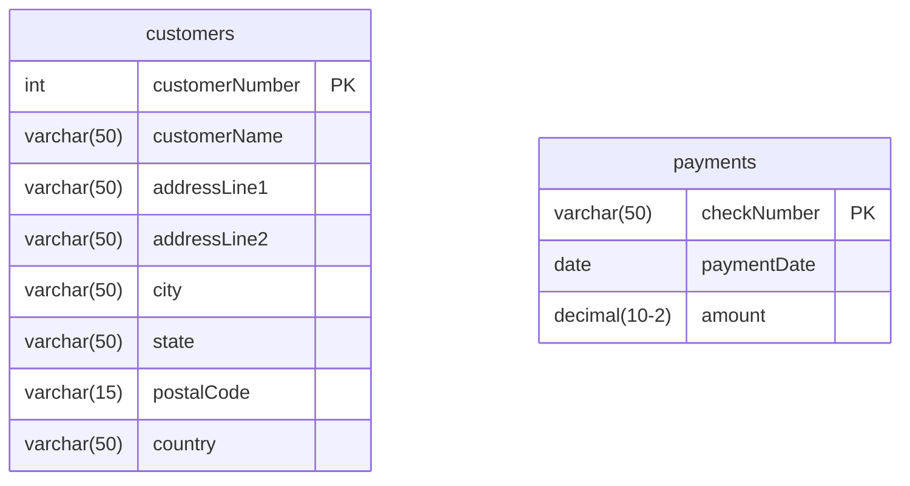

With the current table there is no way to tell which customer made which payment. Given that tables can only hold one piece of information per column our first thought would be to store the customers country of where they placed the order from as seen below

| checkNumber | paymentDate | amount   | country |
| ----------- | ----------- | -------- | ------- |
| HQ336336    | 2004-10-19  | 6066.78  | France  |
| JM555205    | 2003-06-05  | 14571.44 | France  |
| OM314933    | 2004-12-18  | 1676.14  | France  |
| BO864823    | 2004-12-17  | 14191.12 | USA     |
| HQ55022     | 2003-06-06  | 32641.98 | USA     |

With this new table we can now identify where the customers are placing their orders from, however, we still don't know who the exact customer is as multiple people can live in the same country. The second approach would be to use a more unique key, such as the primary key of the customers table:

| checkNumber | paymentDate | amount   | customerNumber |
| ----------- | ----------- | -------- | -------------- |
| HQ336336    | 2004-10-19  | 6066.78  | 103            |
| JM555205    | 2003-06-05  | 14571.44 | 103            |
| OM314933    | 2004-12-18  | 1676.14  | 103            |
| BO864823    | 2004-12-17  | 14191.12 | 112            |
| HQ55022     | 2003-06-06  | 32641.98 | 112            |

Now we are able to directly identify which customer placed what order. Unfortunately, this does create another issue regarding integrity. With the current set up any arbitrary number can be placed into the `customerNumber` section of the table as it soles accepts an integer. This can be with the introduction of **foreign key constraints**.

**Definition:** A rule enforced by the Relational Database Management System (RDBMS) requiring that every non-null value in the foreign key columns must match an existing primary key value in the referenced parent table.

**Guarantees Enforced by the Relational Database Management System(RDBMS):**
- **Insert Guard:** A new child row cannot be inserted unless its FK matches an existing parent PK.
- **Update Guard:** An existing child row's FK cannot be updated to an invalid/nonexistent parent PK.
- **Delete Guard:** A parent row cannot be deleted if child rows still reference it (referential integrity).

With this the integrity issues we faced earlier are completely removed as now the payments table relies on the customer table to have a valid `customerNumber` otherwise there will be an error. This is better shown in the updated diagram below:

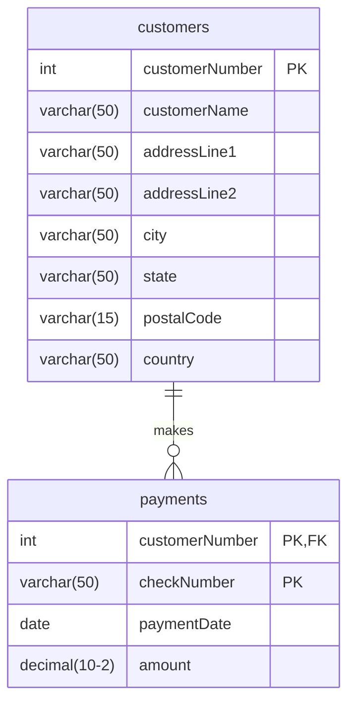
## Constraints and Keys

Now that we have a basic understanding of constraints and foreign keys lets dive a little deeper. As we know, constraints are restrictions enforced by the Relational Database Management System (RDBMS) on what rows are legal in a table, serving as the primary mechanism for preserving data integrity.

Given the following example, Students are entering gpa values as a string into a database column that accepts floats. Here are four possible courses of action:
1. Insert the student's data, but use 0.0 for their gpa column.
2. Insert the student's data, but use NULL for their gpa column.
3. Convert the string value `"3.5"` into the float value `3.5`, then proceed with the insertion.
4. Reject the insertion and report an error.

We can automatically remove the first two as defaulting to `0.0` or `NULL` misrepresents real-world entities. Similarly while string to float conversion is a possibility, it is unreliable because arbitrary strings cannot always be parsed safely. This leaves us with our final option where we outright reject the data trying to enter the table. This is what we call a **Column Type Constraint**.

**Column Type Constraint:** Every inserted value must match the defined data type of its respective column.

We also have another type of constraint called a **Unique Row Constraint**.

**Unique Row Constraint:** No two rows in a table can be completely identical across every column (each row must differ in at least one column).

Now lets take a look at keys and their internal hierarchy:

**Superkeys:** Any set of columns that uniquely identifies a row
- **Candidate Key:** A minimal superkey (no extra columns)
	- **Primary Key:** The single candidate key chosen to serve as the row identifier

A **key** in a database identifies that some set of columns in a table is special in some way. The most important key in a table is its **primary key**: a set of 1 or more columns that _uniquely identify_ every row in the table. 

We saw an example of this in the foreign key example. There, the `customerNumber` was the primary key, meaning that all orders that have the same customer number in their row belong to the same person and anytime that number differed it was a new customer who placed that order. 

Similarly this can be used to differ all rows rather than select ones depending on the circumstances. If we chose to have a business that sells products we would want the primary key to also be the product code so as to ensure that no two products can share the same code.

Here is a more detailed break down of the three main keys:
#### Superkeys

- **Definition:** Any combination of columns that uniquely identifies all rows in a table.
    
- **Trivial Superkeys:** The set of **all columns** in a table is always a superkey due to the unique row constraint.
    
- **Redundancy:** Superkeys often include unnecessary extra columns (e.g., `{productCode, productScale}` is a superkey, but `productScale` is extraneous).
#### 2. Candidate Key

- **Definition:** A superkey from which no attribute can be removed without causing duplicate row violations.
    
- **The "Candidate" Label:** Indicates the set is a qualified applicant to become the table's official primary key.
    
- **The `Departments` Isolation Test:**
    
    - In `Departments (department, chair, building, room)`:
        
        - `{department}` is a candidate key because department names are never repeated.
            
        - `{building, room}` is a candidate key because two departments cannot occupy the identical physical room.
            
        - **Testing `{building, room}` for minimality:**
            
            - Discarding `building` leaves `{room}` $\rightarrow$ **Fails:** Different buildings frequently use identical room numbers (e.g., Room 100 in ECS vs. Room 100 in PSY).
                
            - Discarding `room` leaves `{building}` $\rightarrow$ **Fails:** Multiple departments can reside in the same physical building.
                
            - **Result:** Neither attribute can be dropped, so `{building, room}` is minimal and confirmed as a candidate key.
                
- **Database Implementation Rule:** A table can have multiple candidate keys, but only one primary key. Every unused candidate key must still receive an explicit **`UNIQUE` constraint** in the Data Definition Language (DDL) to prevent duplicate assignments in storage.
#### 3. Primary Key (PK)

- **Definition:** The single candidate key selected to uniquely identify each row in the table.
    
- **Cardinality Rule:** A table has **exactly one** primary key (though that primary key may be **composite**, consisting of multiple columns).
    
- **Cost of Bloated PKs:** Large primary keys require expensive multi-column comparisons during inserts and bloat B-tree index sizes.

| **Key Type**       | **Formal Definition**                                                                                                                              | **Origin & Characteristics**                                                                                                                                         | **UML Modeling Rule**                                                             | **Example**                                             |
| ------------------ | -------------------------------------------------------------------------------------------------------------------------------------------------- | -------------------------------------------------------------------------------------------------------------------------------------------------------------------- | --------------------------------------------------------------------------------- | ------------------------------------------------------- |
| **Natural Key**    | A candidate key composed entirely of existing, real-world domain attributes inherent to the business entity.                                       | Real-world domain attributes inherent to the entity. Often large, composite, or subject to business changes.                                                         | **Allowed in UML**; modeled directly as natural entity attributes.                | `{building, room}`, `{firstName, lastName, dob}`        |
| **Surrogate Key**  | An artificial, system-generated identifier with no semantic relationship to the real-world entity, introduced solely for technical identification. | System-generated, artificial values (often a 4-byte `INT` or 8-byte `BIGINT`) with zero business meaning. Recommended to stay $\le 8$ bytes for indexing efficiency. | **Never expose in UML models**; hide implementation-level database surrogate IDs. | `customerNumber`, `studentId`, `orderId`                |
| **Substitute Key** | A business-supplied, human-readable code or abbreviation adopted as an established standard to represent an entity uniquely and compactly.         | Business-supplied abbreviation or established code that is descriptive and intuitive to domain experts. Guaranteed to be unique.                                     | **Allowed in UML** because it carries descriptive domain meaning.                 | State codes (`CA`, `NY`), currency codes (`USD`, `EUR`) |
| **External Key**   | An identifier created, assigned, and regulated by an external authority or standardizing body outside the local enterprise.                        | Standardized identifier assigned by an outside agency or global standard; ensures cross-organizational uniqueness.                                                   | **Allowed in UML** even if purely numeric or non-descriptive.                     | `ISBN` (Books), `UPC` (Retail), `ZipCode`               |
## One to One Associations

Generally One to One relationships are better off simply being merged into one class. We can make an optional One to One relation however with the example being a person and their passport as shown with the UML model below:

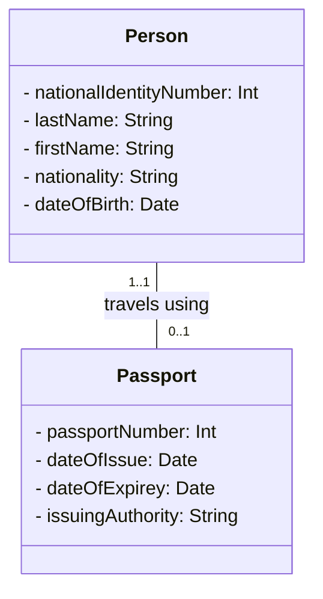

Now that we are moving toward physical relations it is more important to determine which table is the parent an which table is the child. In this case the `Persons` table is the parent:

- **Why `Person` Must Be the Parent:**
    - If `Person` were the child, it would store `passport_number` as an optional foreign key, leading to unnecessary `NULL` values for every person without a passport.
    - Because every `Passport` must belong to a person, placing `national_identity_number` as a mandatory foreign key inside `passports` avoids null values and mirrors the mandatory relationship.
        
- **Why Bidirectional Migration Fails:** Migrating foreign keys into both tables creates redundant data and introduces the risk of conflicting information.

This can further be expressed in the ERD model below:

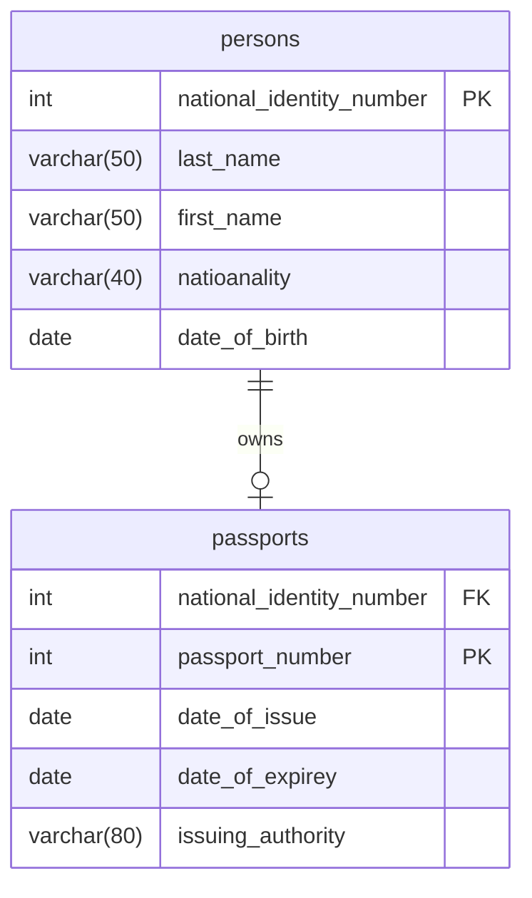

One other thing to consider are **Identifying vs. Non-Identifying Relationships**

| **Concept**                   | **Non-Identifying Relationship**                                                                                                                           | **Identifying Relationship**                                                                                                                                            |
| ----------------------------- | ---------------------------------------------------------------------------------------------------------------------------------------------------------- | ----------------------------------------------------------------------------------------------------------------------------------------------------------------------- |
| **Definition**                | The child entity can be uniquely identified on its own without needing the identity of the parent.                                                         | The child entity cannot be uniquely identified without incorporating the parent's primary key into its own primary key.                                                 |
| **Foreign Key Role in Child** | The migrated FK is a **regular column** (or alternate key), marked as **`FK`** only.                                                                       | The migrated FK is part of the child's **composite primary key**, marked as **`PK, FK`**.                                                                               |
| **Example From Reading**      | **`persons` $\rightarrow$ `passports`**: A passport is uniquely identified purely by `passport_number` (`PK`). `national_identity_number` is only an `FK`. | **`departments` $\rightarrow$ `courses`**: A course number (e.g., `100`) is reused across many departments. It requires `(department, course_number)` together as `PK`. |
| **ERD Notation**              | Indicated with a **dashed relationship line** (or simple foreign key reference without `PK` tag on the FK).                                                | Indicated with a **solid relationship line**; the FK column has both **`PK`** and **`FK`** flags.                                                                       |
The Below diagram gives the example of an identifying relationship where the parents primary key is used to help uniquely identify the child.

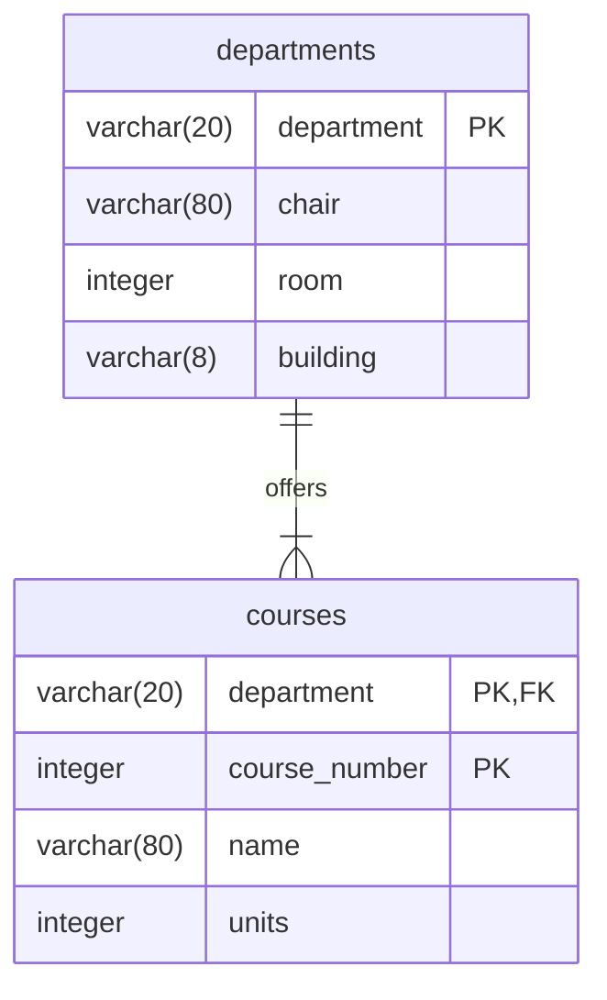
## One to Many Associations

Moving onto the next set of relations, it is know that the one-to-many ($1 \rightarrow 0..\!*$) relationship is the most frequent association pattern in database design (e.g., student to enrollments, customer to orders, passport to stamps).

When looking at the parent and child's of the following diagram:

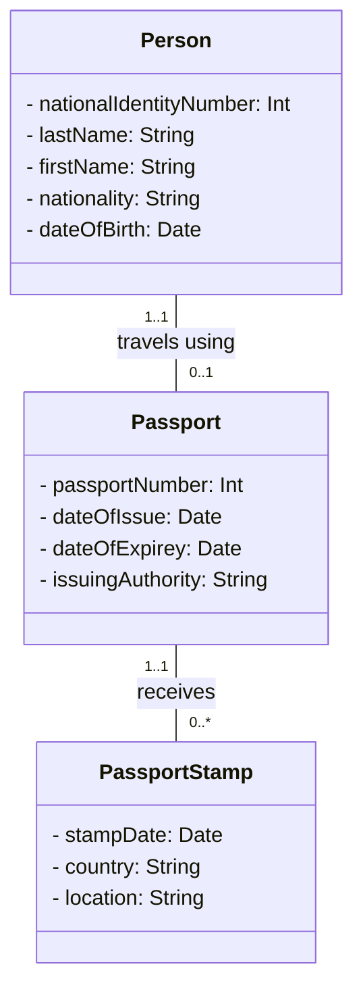
It is easy to see the meaning of the multiplicities as described below: 
- **Parent Side (`Passport`):** Exactly $1$ ($1..1$) — every stamp physically belongs to exactly one passport.
    
- **Child Side (`PassportStamp`):** Zero or more ($0..\!*$) — a newly issued passport has zero stamps initially, accumulating more over time as the person travels.

Looking toward the key relational implementation details now its safe to assume a stamp cannot be uniquely identified by date or country alone (a traveler might visit different countries on different dates) and it is also unreasonable to assume entering the same country multiple times on the exact same date. given this we label the primary key of `passport_stamps` as composite:
$$\{\text{passport\_number, stamp\_date, country}\}$$
	Meaning that the primary key consists of multiple columns. We can also deduce that this is an identifying relationship since the primary key of **Passport:** `passport_number` is a migrated foreign key inside of **PassportStamp** and how `passport_stamps` cant be uniquely identified without the `passport_nuber`. This is represented by marking the ERD's migrated key column with `PK, FK`. This is also represented in the diagram below:

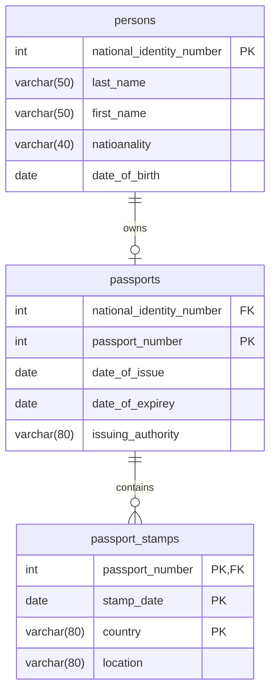

## Many to Many Associations

Many to Many associations under the context of ERD diagrams are a little more complicated to enforce as there is no direct many to many relation ship structure rather the one to many relationship is the only physical type available. To demonstrate further we will be using the diagram below:

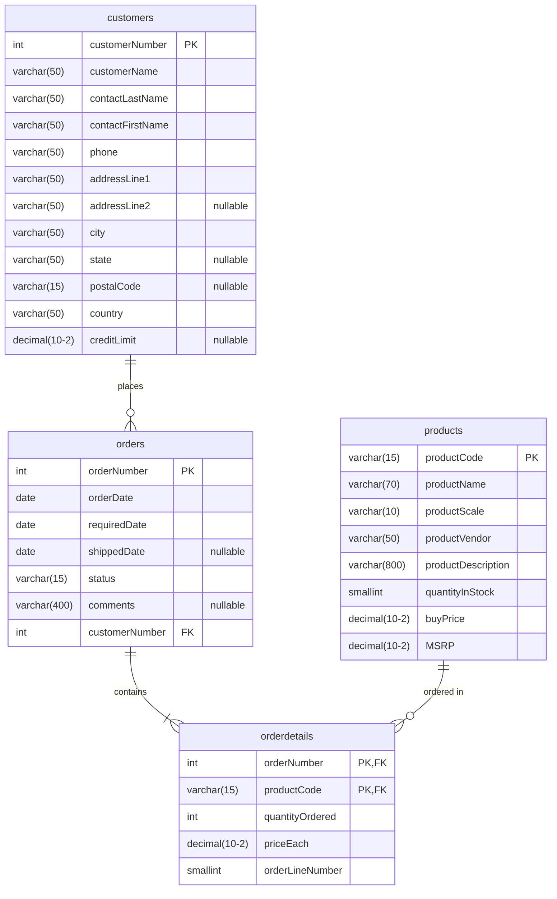

To implement a many-to-many association physically, an intermediary table—known as a **junction table** (or bridge/associative table)—is created. It is important to note that keys never migrate directly between the two parent tables (`orders` and `products`); each parent links independently to the junction table (`orderdetails`).

Its also worth mentioning how the junction tables primary key enforces the UML rule that a specific pair of parent objects can be associated **at most once**:

- **Standard Composite PK:** The primary key of `orderdetails` is formed by combining the foreign keys from both parents:
    $$\{\text{orderNumber, productCode}\}$$
    
- **Consequences of Altering the Primary Key:**
    - _Excluding `productCode`:_ Limits each order to holding **at most one product total**.
    - _Excluding `orderNumber`:_ Prevents any product from appearing in **more than one order**.
        
    - _Adding an extra column (e.g., surrogate or sequence ID) to the PK:_ Permits the same product to be added to the exact same order multiple times, violating standard many-to-many association semantics.

**Surrogate Keys in Junction Tables:** Using a composite PK works cleanly when parent keys are simple integers or strings. However, if parent keys are composite (yielding 4–5+ columns in the junction table), and the junction table itself becomes a **parent** to other dependent tables, managing downstream foreign keys becomes cumbersome.
    
- **Preserving Uniqueness:** If a surrogate primary key (e.g., `orderDetailId`) is introduced, the database integrity must be preserved by placing an explicit **`UNIQUE` constraint / candidate key** on the combined parent foreign keys:
    $$\text{UNIQUE}(\text{orderNumber, productCode})$$

One final important note it to ensure you are also following the **Rules and Restrictions for Junction Tables**
- **Restriction 1 (No Inbound Identifying Foreign Keys):** A junction table cannot act as a child in an identifying relationship where another parent's key migrates into its primary key. Doing so disrupts the two-parent uniqueness semantic of the many-to-many link.
- **Restriction 2 (No Subtyping Categories):** Because the relationship between a generalized supertype and a specialized subtype is always identifying ($1 \leftrightarrow 0..1$), a junction table can **never** be modeled as a subtype category under a superclass.
    
- **Parent Capabilities:** A junction table is fully permitted to act as a **parent** in standard one-to-many relationships with downstream child tables.
## Object Graphs

Now that we understand how to make physical relationship diagrams from our UML models we can test to see if the model we created were correct using **Object Graphs**. For this example we will go back to the customer, payments UML diagram from before:

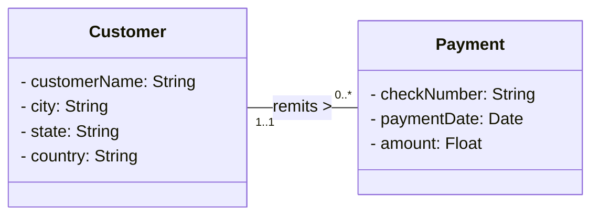

Object Graphs are an informal, visual sketch depicting specific runtime/instance objects from designed classes as nodes, using edges to represent real-world links between them. the first one can be show below:

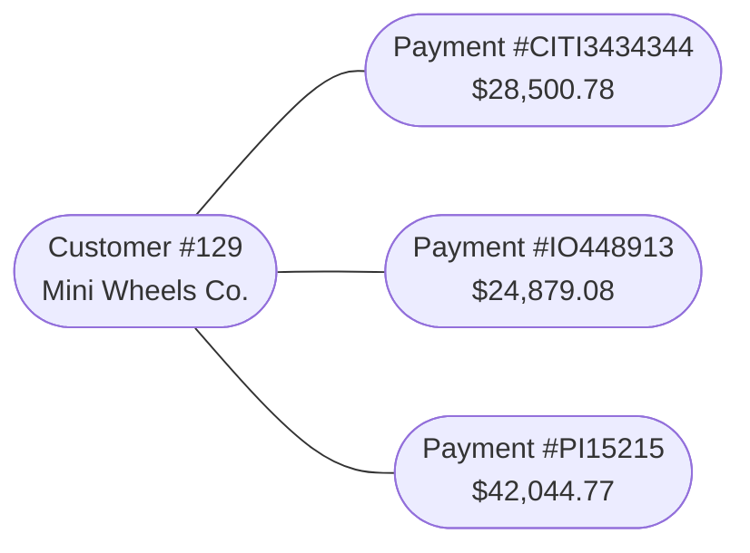

The purpose of each object graph serves as a sanity check to validate UML class models by ensuring the structural multiplicities (cardinalities) declared in the class diagram align with real-world enterprise facts.

Similarly, the level of detail does not require displaying every class attribute—only enough identifying data (e.g., `#129 Mini Wheels Co.`, `Payment #CITI3434344`) to clarify which individual instances are being paired.

It is also important to ensure the object graphs you are creating follow the rules of the UML diagram its being based off of. As an example the below diagram is an illegal representation of our current UML model:

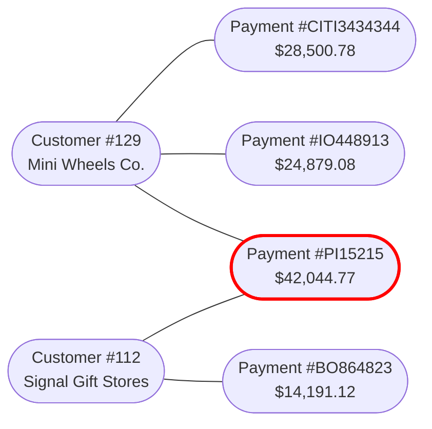

Drawing concrete instances exposes subtle flaws in association cardinality before code or physical schemas are generated:

- **Validating One-to-Many ($1 \rightarrow 0..\!*$):**
    - In the valid graph, one `Customer` node branches out to connect with three distinct `Payment` nodes.
    - Critically, each `Payment` node connects back to **exactly one** `Customer` node.
    - This matches the UML specification: `Customer (1..1) --- remits ---> (0..*) Payment`.
        
- **Detecting Model Conflicts (The "Two Parents" Violation):**
    
    - In the flawed object graph, `Payment #PI15215` has two incoming edges connecting to both `Customer #129` and `Customer #112`.
        
    - **The Evaluation Rule:** When an object graph diverges from the UML model, you must evaluate which artifact is broken:
        1. _If the business permits joint payments shared between multiple distinct customers:_ The UML diagram is incorrect and must be revised to a many-to-many ($*\leftrightarrow *$) association.
        2. _If business rules state that each payment covers only one customer's account:_ The UML class diagram is correct, and the object graph represents an illegal enterprise scenario.

Overall, it is important to check which model is wrong. This way you can confirm of the model needs any changes or if you mis-interpreted what the model is describing