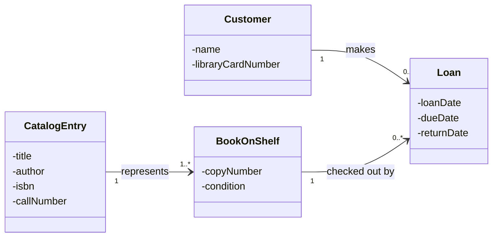

## Many to Many Associations

So far we have looked at relations such as One to Many One to One and, Many to One can also be considered a relation although it is just he reverse of One to Many. One reason to use Many to Many relations is for when we want many attributes of one class to tie with many attributes of another. For example:
- _(Order):_ An `Order` **must** contain at least one `Product` ($1..\!*$) because an empty order is invalid.
- _(Product):_ A `Product` **may** be contained in zero or many `Orders` ($0..\!*$) because a newly added product might not have been purchased yet.

In UML diagrams a class often references an instance of an item with an attribute rather than a physical object. If is also important to ensure that if an attribute depends on both classes placing it in either stand alone class can create logic faults, for example:
- Placing `salePrice` inside `Product` prevents custom customer discounts, sale pricing, or historical price changes.
- Placing `salePrice` inside `Order` limits every product in that order to a single price point.

To solve this we can place store these as association attributes (e.g., `quantity`, `priceEach`).

This can be shown in a UML diagram by connecting the associative attributes class to a many to many relationship diagram with a dotted line

![[Pasted image 20260908202906.png]]

One other element to note regarding Many to Many relations are Derived Attributes. These are attributes that can be calculated by using other attributes already present within the UML diagram, we can denote these by adding a `/` before the name of the attribute (e.g., `/subtotal`, `/orderTotal`)

Here is also a table summary of any to many relations

| **Component**          | **Example Class** | **Role**                                                         | **Multiplicity**           |
| ---------------------- | ----------------- | ---------------------------------------------------------------- | -------------------------- |
| **Parent Entity**      | `Customer`        | Initiates actions / owns child transactions                      | `1`                        |
| **Transaction Entity** | `Order`           | Bridges customer activity with products                          | `0..*`                     |
| **Association Class**  | `OrderDetail`     | Holds line-item association attributes (`quantity`, `priceEach`) | _Attached via dotted line_ |
| **Catalog Entity**     | `Product`         | Standard lookup item available across multiple orders            | `0..*`                     |
## Many to May with History

One major issue with a Many to Many associations is that it prohibits the same two objects from relating to each other more that once, even with an association class. This is because sets of pairs by default remove duplicates, furthermore the reason an association class doesn't resolve it is because that class only allows descriptive attributes of the already provided attributes. An example would be:
- In an Order–Product relationship, `OrderDetail` allows setting quantity and price, but the same product cannot appear as two distinct lines on the exact same order (e.g., selling 10 units at a sale price and 5 units at full price within one order).

When two objects must associate more than once, replace the direct binary many-to-many association entirely with a **first-class intermediary entity (an event/transaction class)**:
1. **Eliminate the Direct Association:** Remove the direct many-to-many line connecting the two classes.
    
2. **Introduce an Intermediary Event Class:** Create a regular class representing the real-world occurrence (e.g., `Loan`, `PizzaLayer`, `Enrollment`).
    
3. **Add a Differentiating Attribute:** Include an attribute inside the intermediary class to uniquely distinguish repeat occurrences between the same two objects. This is typically:
    - A temporal marker (e.g., `checkoutDate`, `timestamp`) for historical events.
    - An ordinal/sequence marker (e.g., `layerNumber`, `attemptNumber`) for structural or step-based repetitions.
        
4. **Form Two One-to-Many Associations:**
    - Parent Class A ($1$) $\longrightarrow$ Intermediary Event Class ($0..\!*$)
    - Parent Class B ($1$) $\longrightarrow$ Intermediary Event Class ($0..\!*$)

Below is a table for better clarification

| **Question to Ask**                                    | **Resulting Structure**                                                                                             | **Example**                                                                                      |
| ------------------------------------------------------ | ------------------------------------------------------------------------------------------------------------------- | ------------------------------------------------------------------------------------------------ |
| Can the same two objects associate **more than once**? | **NO** $\rightarrow$ Standard Binary Association (with optional **Association Class** for line attributes)          | `Order` $\leftrightarrow$ `Product` via `OrderDetail` (a product appears at most once per order) |
| Can the same two objects associate **more than once**? | **YES** $\rightarrow$ **Many-to-Many with History Pattern** (explicit intermediary class + discriminator attribute) | `Customer` $\leftrightarrow$ `BookOnShelf` via `Loan` with `checkoutDate`                        |
Here is also a breakdown of the responsibilities of the Library Loan Case Study as well as a UML model:
#### Class Responsibilities
- **`Customer`:** Represents registered library patrons eligible to borrow books.
- **`CatalogEntry`:** Represents bibliographic metadata (e.g., title, ISBN, description) analogous to a catalog card.
- **`BookOnShelf`:** Represents the physical copy/item sitting on a shelf, resolving the physical copy vs. abstract title distinction.    
- **`Loan`:** Represents the discrete checkout event connecting a customer to a physical book.

#### Multiplicity & Association Breakdown
- **`Customer` (1) to `Loan` ($0..\!*$):** A loan requires exactly one customer; a registered customer may have zero or many loan events over time.
- **`BookOnShelf` (1) to `Loan` ($0..\!*$):** A loan records the checkout of exactly one physical volume; a physical book can be checked out zero or many times over its lifecycle.    
- **`CatalogEntry` (1) to `BookOnShelf` ($1..\!*$):** A physical book is an instance of exactly one catalog entry; a catalog entry must represent at least one physical copy on the shelf.

